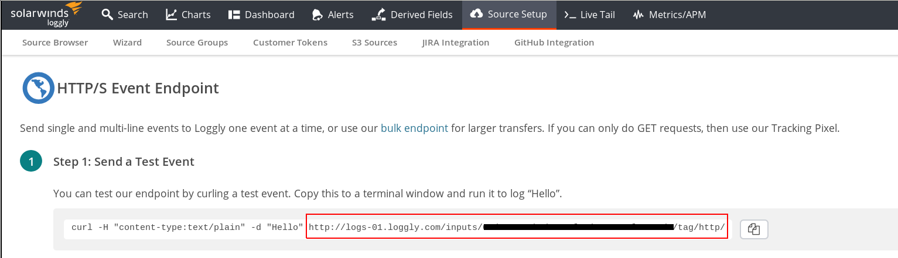

# Storing a balena device's journal logs

This project is an example of how to persist a device's
journal logs to either the disk, or the [loggly cloud service](https://www.loggly.com/).

Note that this project should be used as an example only,
and the methods used to post logs to loggly are inefficient.
No log rotation is implemented if the project is not using
the loggly backend, which means that the device file system
can fill up over time.

This project requires a device running balena-supervisor
version >= v10.3.0.

## Usage

Create an application on the [balena dashboard](https://dashboard.balena-cloud.com), with the
device type you plan to use. We will assume an application
name of `logging-app` for the rest of this usage
explanation.

Push this project to an application using
[balena-cli](https://github.com/balena-io/balena-cli):

```bash
$ balena push logging-app
```

### Saving logs to disk

By default this project will write the journal logs to disk.
The location of these logs will be `/logs/log.journal` in
the `log-gatherer` container. This location is actually the
mount point of the docker volume `log-volume`, defined in
our `docker-compose.yml` file.

### Exporting logs to the loggly service

This option requires a loggly account, and the HTTPS
endpoint available from the loggly dashboard:



Take this URL and assign it to the device environment
variable `LOGGLY_URL` on the balena dashboard. This will
cause the service to restart and the logs will instead be
streamed to loggly, and not saved on disk.
